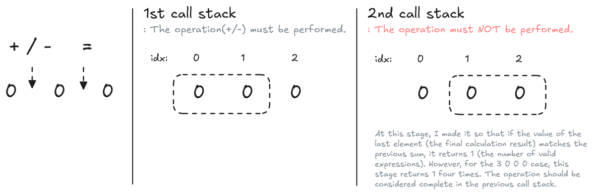

- ⌛ Too time-consuming (about 2H)
- 🎨 Visualize in a diagram

# 🎨 Visualize in a diagram

There was a problem where the answer was 4 for the test case 3 0 0 0. This happened because the algorithm was designed to include the position of the = operator in the calculation. I realized that drawing a diagram helped me identify and fix this issue. Using a diagram makes it much easier to think through index assignments. That’s how I understood why the recursive function must terminate when d == N - 2.

It was quite simple, but it was still useful enough! -> Let's draw a lot by hand!

